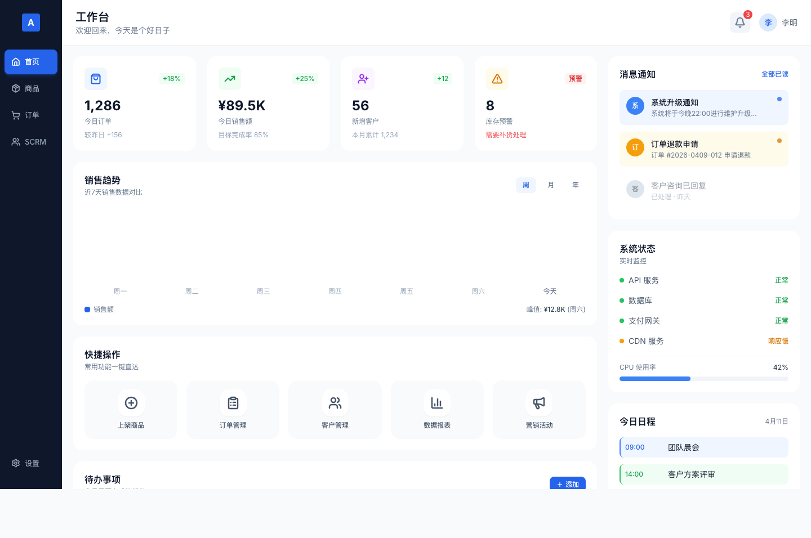
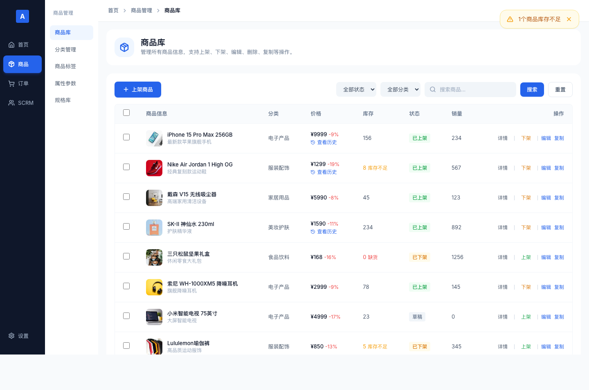
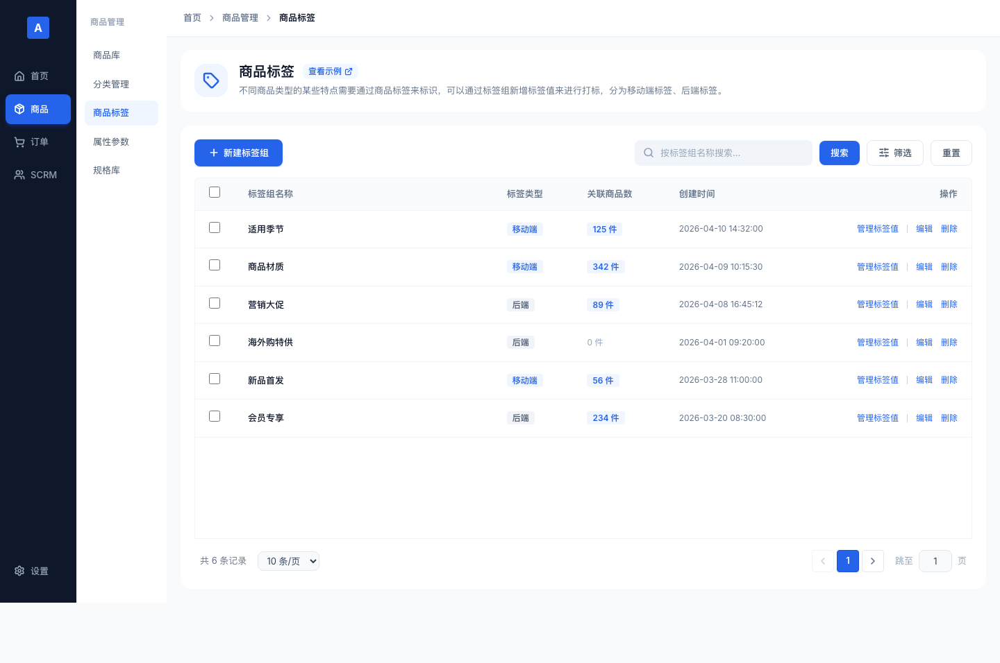
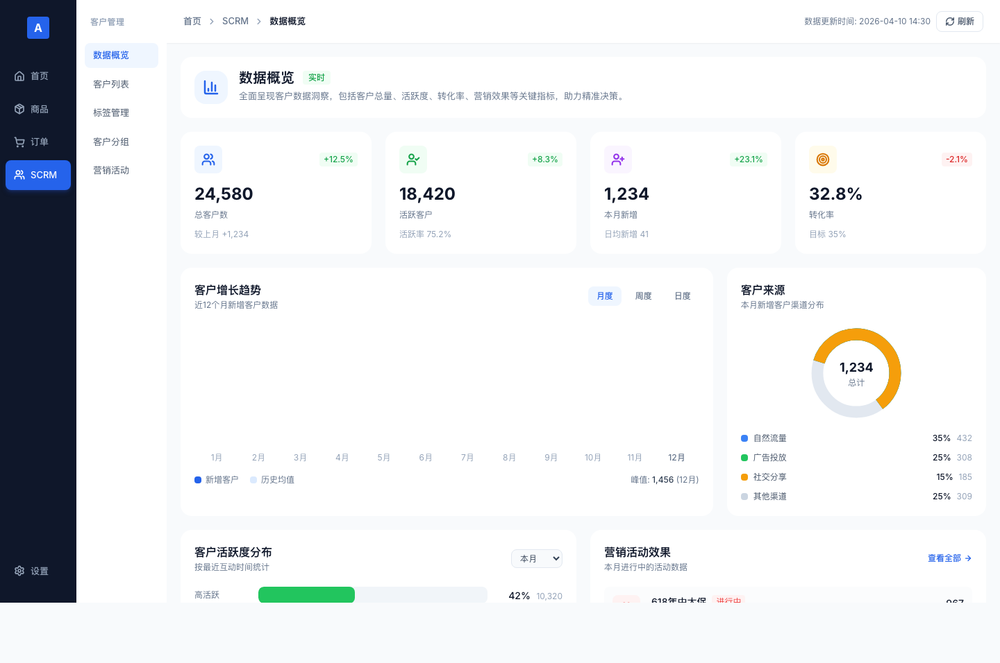

# Astre-skill

Astra UI Design System skill pack for generating UI pages that conform to Astra specifications.

## Current Version

**v1.9.1** - Gate Contract / Component mapping migrated to references + gate scripts aligned

## Version History

| Version | Date | Changes |
|---------|------|---------|
| v1.9.1 | 2026-04-11 | Migrated Gate Contract and shadcn/ui component mapping to `references/`; synced SYSTEM_GUIDE, gate scripts, and tests |
| v1.9.0 | 2026-04-11 | Added Checkbox/Radio and default border token rules; synced 4 HTML demos; added screenshot preview links to README |
| v1.8.0 | 2026-04-10 | shadcn/ui component mapping + page-agent automated testing + icon hard rules |
| v1.7.0 | 2026-04-10 | Progressive Disclosure architecture — SKILL.md slimmed + references/ separated |
| v1.6.0 | 2026-04-10 | Full Guidelines content embedded |
| v1.5.0 | 2026-04-10 | Complete Design Token system + on-demand Guidelines reading guide |
| v1.4.0 | 2026-04-10 | shadcn/ui component installation manifest, grouped by category |
| v1.3.0 | 2026-04-10 | Using shadcn/ui Chart component while keeping Astra minimal color palette |
| v1.2.0 | 2026-04-10 | Added Analytics Dashboard template, chart color rules |
| v1.1.0 | 2026-04-10 | Strengthened minimal design principles, added visual style examples |
| v1.0.0 | 2026-04-10 | Initial release, complete skill pack |

## Installation

```bash
# Clone the repository
git clone https://github.com/yuge8899/Astre-skill.git

# Create a symbolic link
ln -sf /path/to/Astre-skill/skills/astra-ui ~/.agents/skills/astra-ui
```

## Usage

Invoke in Claude Code:

```
/astra-ui Create a settings page
/astra-ui Create an analytics dashboard page
/astra-ui What layout should a data list use?
/astra-ui What variants does Button have?
/astra-ui Validate this page
```

## HTML Demo Screenshot Previews

The online preview links use the `main` branch as the long-term entry point. For the latest changes in the current branch or PR, use the local static server preview below.

<table>
  <tr>
    <td width="50%" valign="top">
      <strong>Home Dashboard</strong><br>
      <a href="https://htmlpreview.github.io/?https://raw.githubusercontent.com/yuge8899/Astre-skill/main/workflow/demos/dashboard-demo.html">
        
      </a><br>
      Workspace home with KPIs, to-dos, activity feed, and calendar<br>
      <a href="https://htmlpreview.github.io/?https://raw.githubusercontent.com/yuge8899/Astre-skill/main/workflow/demos/dashboard-demo.html">Live Preview</a> ·
      <a href="workflow/demos/dashboard-demo.html">Source</a>
    </td>
    <td width="50%" valign="top">
      <strong>Product Catalog</strong><br>
      <a href="https://htmlpreview.github.io/?https://raw.githubusercontent.com/yuge8899/Astre-skill/main/workflow/demos/product-list-demo.html">
        
      </a><br>
      Product list, filters, bulk actions, detail drawer<br>
      <a href="https://htmlpreview.github.io/?https://raw.githubusercontent.com/yuge8899/Astre-skill/main/workflow/demos/product-list-demo.html">Live Preview</a> ·
      <a href="workflow/demos/product-list-demo.html">Source</a>
    </td>
  </tr>
  <tr>
    <td width="50%" valign="top">
      <strong>Product Tags</strong><br>
      <a href="https://htmlpreview.github.io/?https://raw.githubusercontent.com/yuge8899/Astre-skill/main/workflow/demos/product-tags-demo.html">
        
      </a><br>
      Tag management, filtering, status and configuration<br>
      <a href="https://htmlpreview.github.io/?https://raw.githubusercontent.com/yuge8899/Astre-skill/main/workflow/demos/product-tags-demo.html">Live Preview</a> ·
      <a href="workflow/demos/product-tags-demo.html">Source</a>
    </td>
    <td width="50%" valign="top">
      <strong>SCRM Data Overview</strong><br>
      <a href="https://htmlpreview.github.io/?https://raw.githubusercontent.com/yuge8899/Astre-skill/main/workflow/demos/scrm-dashboard-demo.html">
        
      </a><br>
      Business overview, trends, and operational metrics<br>
      <a href="https://htmlpreview.github.io/?https://raw.githubusercontent.com/yuge8899/Astre-skill/main/workflow/demos/scrm-dashboard-demo.html">Live Preview</a> ·
      <a href="workflow/demos/scrm-dashboard-demo.html">Source</a>
    </td>
  </tr>
</table>

To preview a local branch, start a static server:

```bash
python3 -m http.server 8080
```

Then open `http://localhost:8080/workflow/demos/dashboard-demo.html`. Replace the filename for other pages.

## Directory Structure

```
Astre-skill/
├── README.md
├── CHANGELOG.md
├── skills/
│   └── astra-ui/
│       ├── SKILL.md          # Main skill file
│       └── references/       # Detailed rules loaded on demand
│           ├── gate-contract.md # Machine-readable gate contract
│           ├── tokens.md        # Design Tokens (Tailwind v4)
│           ├── components.md    # shadcn/ui component mapping
│           ├── icons.md         # lucide.dev icon spec
│           ├── page-agent.md    # Automated testing
│           ├── templates.md     # Page templates
│           ├── animation.md     # Animation rules
│           ├── modes.md         # Dark mode
│           └── focus.md         # Focus styles
├── workflow/
│   ├── demos/
│   │   ├── dashboard-demo.html
│   │   ├── product-list-demo.html
│   │   ├── product-tags-demo.html
│   │   └── scrm-dashboard-demo.html
│   └── previews/
│       ├── dashboard-demo.png
│       ├── product-list-demo.png
│       ├── product-tags-demo.png
│       └── scrm-dashboard-demo.png
└── guidelines/               # Source rule documents
```

## Design System Highlights

- **Style**: Professional B2C SaaS — minimal, clean, breathable
- **Color**: Tailwind v4 Blue/Slate, 90% neutral colors
- **Layout**: Card-based, borderless, separated by surface color contrast
- **Component stack**: shadcn/ui + lucide-react + Arco Tabs
- **Automation**: page-agent natural-language testing

## Dependency Installation

```bash
# Initialize shadcn/ui
npx shadcn@latest init

# Install common components
npx shadcn@latest add button card input textarea select checkbox switch radio-group label badge toast tooltip dialog sheet table pagination avatar dropdown-menu separator scroll-area skeleton tabs breadcrumb

# Install icon library
npm install lucide-react

# Install automated testing (optional)
npm install page-agent
```
