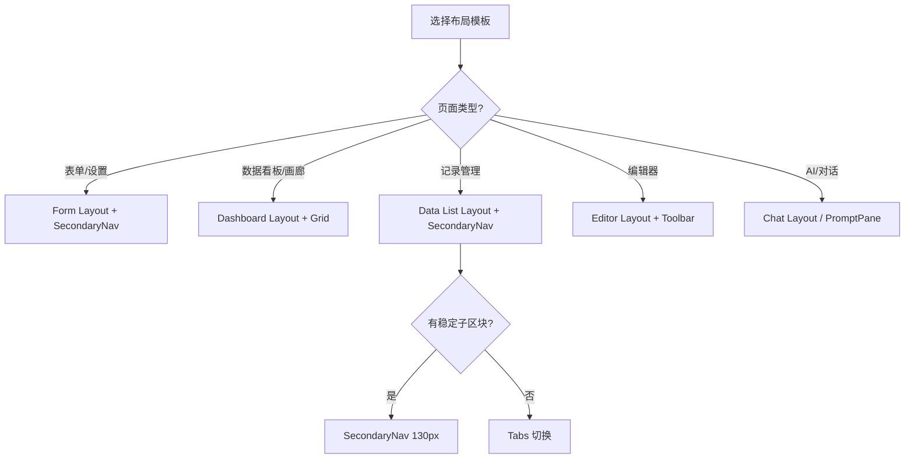

# Astra UI 页面布局结构

本指南定义了极简专业 B2C SaaS 风格的标准页面布局结构。所有新页面或重构页面均应遵循此规范。

## Layout 决策树



## 核心布局组件

所有布局必须基于以下层级构建：

1. **PrimaryNav (一级导航)**: 宽度 110px, 背景 `bg-slate-900`, 图标+文字**横向排列**。
2. **SecondaryNav (二级导航)**: 宽度 130px, 背景 `bg-white`, 纯文字列表。
3. **Main Content (主体内容)**: 
   - 顶部固定 **Breadcrumb Header**: 背景 `bg-white`, 固定定位。
   - 内部滚动区: `p-5` (20px) 安全边距, 背景 `bg-slate-50`。

## 页面解剖图 (基于最新组件规范)

```
┌──────────┬─────────────┬─────────────────────────────────────────────────────────┐
│ Primary  │ Secondary   │ [Fixed Header] bg-white                                 │
│ Nav      │ Nav         │ Breadcrumb: Home > Categories > Current Page           │
│ 110px    │ 130px       ├─────────────────────────────────────────────────────────┤
│          │             │ [Scrollable Content Area] bg-slate-50, p-5              │
│ bg-slate-│ bg-white    │                                                         │
│   900    │             │  ┌───────────────────────────────────────────────────┐  │
│          │             │  │ [Functional Header Card] bg-white, rounded-xl     │  │
│ [🏠]Home │ Category    │  │ ┌──────┐ [Title]                                  │  │
│ [📦]Prod │ ├ Item 1    │  │ │ Icon │ [Description Text]                       │  │
│ [🛒]Order│ ├ Item 2*   │  │ └──────┘                                          │  │
│ [📊]Data │ └ Item 3    │  └───────────────────────────────────────────────────┘  │
│          │             │                                                         │
│          │             │  ┌───────────────────────────────────────────────────┐  │
│ [⚙️]Set  │             │  │ [Data Card] bg-white, rounded-xl                  │  │
│          │             │  │                                                   │  │
│ [U] User │             │  │ [+ New Action]                      [Search Bar]  │  │
│          │             │  │ ───────────────────────────────────────────────── │  │
│          │             │  │ [Tabs (Arco)]                                     │  │
│          │             │  │ ───────────────────────────────────────────────── │  │
│          │             │  │ Table (Fixed Actions Right)                       │  │
│          │             │  │ [Row 1]   [Action Action Action]                  │  │
│          │             │  │ [Row 2]   [Action Action Action]                  │  │
│          │             │  │ ───────────────────────────────────────────────── │  │
│          │             │  │ [Pagination Bar]                                  │  │
│          │             │  └───────────────────────────────────────────────────┘  │
│          │             │                                                         │
└──────────┴─────────────┴─────────────────────────────────────────────────────────┘
```

## 关键布局代码示例 (React/Tailwind)

```tsx
export default function StandardPage() {
  return (
    <div className="flex h-screen overflow-hidden text-slate-900 bg-slate-50">
      {/* 1. 一级导航 */}
      <nav className="w-[110px] bg-slate-900 flex flex-col shrink-0">
        {/* Logo and Items */}
      </nav>

      {/* 2. 二级导航 */}
      <nav className="w-[130px] bg-white py-6 px-3 shrink-0">
        {/* Sub-menu Items */}
      </nav>

      {/* 3. 主内容区 */}
      <main className="flex-1 overflow-hidden flex flex-col">
        {/* 固定面包屑报头 */}
        <header className="bg-white px-6 py-4 flex items-center justify-between shrink-0 shadow-sm z-10">
          <Breadcrumb>
            {/* Breadcrumb items */}
          </Breadcrumb>
        </header>

        {/* 滚动容器 */}
        <div className="flex-1 overflow-y-auto p-5 space-y-5">
          {/* 功能说明卡片 */}
          <section className="bg-white rounded-xl p-5 flex items-center gap-4">
            <div className="w-12 h-12 rounded-xl bg-blue-50 text-blue-600 flex items-center justify-center shrink-0">
              <Icon size={24} strokeWidth={2.5} />
            </div>
            <div>
              <h1 className="text-xl font-bold">页面标题</h1>
              <p className="text-sm text-slate-500">此页面的核心功能和操作说明。</p>
            </div>
          </section>

          {/* 数据业务卡片 */}
          <section className="bg-white rounded-xl p-5 flex flex-col min-h-0">
            {/* 顶层动作栏 */}
            <div className="flex items-center justify-between mb-5">
              <Button variant="primary">+ 新建任务</Button>
              <div className="flex gap-2">
                <Input placeholder="搜索..." className="w-64" />
                <Button>搜索</Button>
              </div>
            </div>

            {/* 表格容器 */}
            <div className="flex-1 overflow-auto rounded-lg bg-white">
              <Table />
            </div>

            {/* 分页 */}
            <Pagination className="mt-4" />
          </section>
        </div>
      </main>
    </div>
  );
}
```

## 硬性规则提醒
- **无描边、无阴影**: 所有卡片容器必须使用 `bg-white` 且不带 `border` 或 `shadow` (除了浮动的 Header 允许极简阴影)。
- **安全边距**: 内容区域四周必须留出完整的 `p-5` (20px) 视觉安全区。
- **左侧优先**: 所有的核心操作按钮（如“新建”）必须放在卡片区域的左上角首位。
