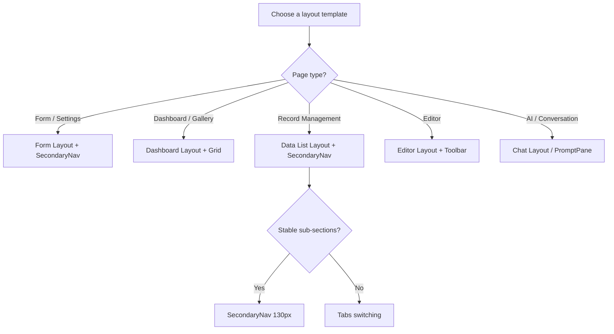

# Astra UI Page Layout Structure

This guide defines the standard page layout structure for the minimal, professional B2C SaaS style used by Astra UI. Every new page and every refactored page should follow this specification.

## Layout Decision Tree



## Core Layout Components

Every layout must be built on the following hierarchy:

1. **PrimaryNav**: width `110px`, background `bg-slate-900`, icon + label must be arranged **horizontally**.
2. **SecondaryNav**: width `130px`, background `bg-white`, text-only list.
3. **Main Content**:
   - Fixed **Breadcrumb Header** at the top: background `bg-white`, fixed positioning.
   - Internal scroll area: safe margin `p-5` (20px), background `bg-slate-50`.

## Page Anatomy Diagram

```
┌──────────┬─────────────┬─────────────────────────────────────────────────────────┐
│ Primary  │ Secondary   │ [Fixed Header] bg-white                                 │
│ Nav      │ Nav         │ Breadcrumb: Home > Categories > Current Page           │
│ 110px    │ 130px       ├─────────────────────────────────────────────────────────┤
│          │             │ [Scrollable Content Area] bg-slate-50, p-5              │
│ bg-slate-│ bg-white    │                                                         │
│   900    │             │  ┌───────────────────────────────────────────────────┐  │
│          │             │  │ [Functional Header Card] bg-white, rounded-xl     │  │
│ [🏠]Home │ Category    │  │ ┌──────┐ [Title]                                  │  │
│ [📦]Prod │ ├ Item 1    │  │ │ Icon │ [Description Text]                       │  │
│ [🛒]Order│ ├ Item 2*   │  │ └──────┘                                          │  │
│ [📊]Data │ └ Item 3    │  └───────────────────────────────────────────────────┘  │
│          │             │                                                         │
│          │             │  ┌───────────────────────────────────────────────────┐  │
│ [⚙️]Set  │             │  │ [Data Card] bg-white, rounded-xl                  │  │
│          │             │  │                                                   │  │
│ [U] User │             │  │ [+ New Action]                      [Search Bar]  │  │
│          │             │  │ ───────────────────────────────────────────────── │  │
│          │             │  │ [Tabs (Arco)]                                     │  │
│          │             │  │ ───────────────────────────────────────────────── │  │
│          │             │  │ Table (Fixed Actions Right)                       │  │
│          │             │  │ [Row 1]   [Action Action Action]                  │  │
│          │             │  │ [Row 2]   [Action Action Action]                  │  │
│          │             │  │ ───────────────────────────────────────────────── │  │
│          │             │  │ [Pagination Bar]                                  │  │
│          │             │  └───────────────────────────────────────────────────┘  │
│          │             │                                                         │
└──────────┴─────────────┴─────────────────────────────────────────────────────────┘
```

## Key Layout Example (React / Tailwind)

```tsx
export default function StandardPage() {
  return (
    <div className="flex h-screen overflow-hidden bg-slate-50 text-slate-900">
      {/* 1. Primary navigation */}
      <nav className="flex w-[110px] shrink-0 flex-col bg-slate-900">
        {/* Logo and Items */}
      </nav>

      {/* 2. Secondary navigation */}
      <nav className="w-[130px] shrink-0 bg-white px-3 py-6">
        {/* Sub-menu Items */}
      </nav>

      {/* 3. Main content area */}
      <main className="flex min-w-0 flex-1 flex-col overflow-hidden">
        {/* Fixed breadcrumb header */}
        <header className="z-10 flex shrink-0 items-center justify-between bg-white px-6 py-4 shadow-sm">
          <Breadcrumb>
            {/* Breadcrumb items */}
          </Breadcrumb>
        </header>

        {/* Scroll container */}
        <div className="flex-1 space-y-5 overflow-y-auto p-5">
          {/* Functional header card */}
          <section className="flex items-center gap-4 rounded-xl bg-white p-5">
            <div className="flex h-12 w-12 shrink-0 items-center justify-center rounded-xl bg-blue-50 text-blue-600">
              <Icon size={24} strokeWidth={2.5} />
            </div>
            <div>
              <h1 className="text-xl font-bold">Page Title</h1>
              <p className="text-sm text-slate-500">
                Explain the core purpose and actions of this page here.
              </p>
            </div>
          </section>

          {/* Main business card */}
          <section className="flex min-h-0 flex-col rounded-xl bg-white p-5">
            {/* Top action bar */}
            <div className="mb-5 flex items-center justify-between">
              <Button variant="primary">+ New Task</Button>
              <div className="flex gap-2">
                <Input className="w-64" placeholder="Search..." />
                <Button>Search</Button>
              </div>
            </div>

            {/* Table container */}
            <div className="flex-1 overflow-auto rounded-lg bg-white">
              <Table />
            </div>

            {/* Pagination */}
            <Pagination className="mt-4" />
          </section>
        </div>
      </main>
    </div>
  );
}
```

## Hard Reminders

- **No border, no shadow**: All card containers must use `bg-white` without `border` or `shadow` (except the floating header, which may use a minimal shadow).
- **Safe margins**: The content area must keep a complete visual safe zone of `p-5` (20px).
- **Left-first priority**: Core action buttons such as "Create" must appear first at the top-left of the card area.
